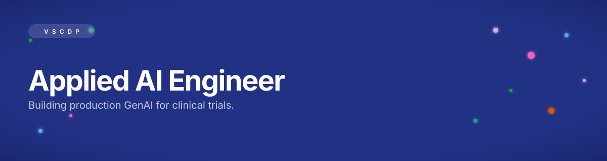

<!--
  Notion-inspired GitHub profile README for @vamsitallapudi.
  Design language: DESIGN-notion.md — warm calm, one Notion-blue accent (#0075de),
  sticker palette used only decoratively, heavy tight display type in the hero SVG.
  Content source: resume.txt (all quantitative claims copied verbatim).
-->

  

<!-- Contact row — the ONLY place Notion blue (#0075de) paints a CTA -->

  
  &nbsp;
  
  &nbsp;
  <a href="mailto:vamsii.tallapudi@gmail.com"><!-- TODO: fill email -->
    
  </a>

 

## Hi, I'm Vamsi 👋

Applied AI Engineer with **4+ years** across healthcare and pharma, specializing in production GenAI systems — RAG pipelines, LLM evaluation, and clinical document intelligence. I've built and shipped AI platforms that replaced a **~$1.5M/yr commercial vendor**, cut clinical authoring time from **hours to minutes**, and drove an estimated **$700K+ in annual savings**.

Deep experience turning unstructured protocols, safety data, and regulatory documents into structured, audit-ready outputs using Python, SQL, and frontier LLMs (Claude, GPT, Gemini). Author of an LLM benchmark under review at **EMNLP**, with a growing focus on evaluation systems and mechanistic interpretability.

## ✦ Featured Work

<table>
  <tr>
    <td width="50%" valign="top">
      
      <h3>Compass — Risk-Based Site Monitoring</h3>
      

        Risk-based site-monitoring platform for clinical trials that ingests CTMS + operational data, computes explainable <b>Workload</b> and <b>Risk</b> scores for every site, and auto-generates monitor visit-prep summaries.
      

      

        <b>Impact —</b> Replaced a ~<b>$1.5M/yr</b> commercial RBM vendor license and cut low-value on-site monitoring visits by an estimated <b>~30%</b> (~$400K/yr in avoided travel and CRA time). Every score traceable to raw signals for audit and inspection readiness.
      

    </td>
    <td width="50%" valign="top">
      
      <h3>ClinTrailBench — LLM Eval Benchmark</h3>
      

        Benchmark for evaluating LLM reasoning and regulatory compliance using <b>FDA warning letters</b> and <b>ICH / 21 CFR</b> guidance across Claude, Gemini, GPT, DeepSeek, and other frontier models.
      

      

        <b>Impact —</b> Under review at <b>EMNLP</b> — <i>"ClinTrailBench: Strong on the Exam, Weak on the (GxP) Job."</i> Novel evaluation suite exposing the gap between LLMs' exam-style knowledge and real clinical-trial operational competence.
      

    </td>
  </tr>
  <tr>
    <td width="50%" valign="top">
      
      <h3>Protocol Amendment Analyzer</h3>
      

        AI-powered analyzer using Python, custom DOCX/XML parsing, and <b>GPT-4.1</b> to compare protocol revisions and automatically generate change summaries.
      

      

        <b>Impact —</b> Achieved <b>90%+</b> accuracy against SME validation while eliminating ~<b>60 hours</b> of manual review per week across <b>25–40 protocols</b> monthly.
      

    </td>
    <td width="50%" valign="top">
      
      <h3>Clinical Safety Narratives — GenAI Pipeline</h3>
      

        End-to-end GenAI pipeline using <b>Claude</b> models, <b>RAG</b>, prompt engineering, and structured outputs to automatically generate clinical Safety Narratives.
      

      

        <b>Impact —</b> Reduced authoring time from <b>2 hours to 2 minutes</b>, contributing to an estimated <b>$300K–$400K</b> in annual operational savings.
      

    </td>
  </tr>
</table>

## ✦ Experience

<table>
  <tr>
    <td valign="top" width="230"><b>Sanofi</b> Software Engineering Expert Digital R&D <i>Feb 2026 — Present · Hyderabad</i></td>
    <td valign="top">
      Building <b>Compass</b> (RBM platform) and designing <b>ClinTrailBench</b> (EMNLP submission). Prototyped a PDFPlumber → Markdown → Claude pipeline converting protocol PDFs into visit × assessment JSON matrices, reaching ~<b>85%</b> field-level extraction accuracy over ~30 protocols with a Gemini LLM-as-judge eval. Led an interpretability PoC applying <b>Sparse Autoencoders (SAEs)</b> to GPT-2 and Microsoft <b>BioGPT</b>.
    </td>
  </tr>
  <tr>
    <td valign="top"><b>Bristol-Myers Squibb</b> Software Engineer 2 DDIT — Applied AI <i>May 2024 — Jan 2026 · Hyderabad</i></td>
    <td valign="top">
      Shipped the <b>Protocol Amendment Analyzer</b> and the <b>Safety Narratives</b> pipeline. Built Python/SQL ETL bridging <b>Redshift</b> and <b>Impala</b> into GenAI workflows, consolidating <b>15+ clinical datasets</b> (~$350K organization-wide impact). Developed NER pipelines with Gemini/OpenAI to extract <b>ICD-10/11, HIPAA</b>, procedural, and drug codes across <b>100+ protocols</b>. Managed ingestion and validation for <b>600+ study protocols</b> and validated 4 Tableau dashboards. Analyzed market insights across <b>52 countries</b> using Python + NLTK.
    </td>
  </tr>
  <tr>
    <td valign="top"><b>Cognizant</b> Senior Systems Engineer <i>Jul 2022 — Apr 2024 · Bangalore</i></td>
    <td valign="top">
      Cloud-based data solutions in Python, SQL, Excel, and MongoDB — data processing, cleaning, validation, and automation. Applied ML for data classification and optimized reporting workflows across Agile and Waterfall delivery.
    </td>
  </tr>
</table>

## ✦ Tech Stack

<b>GENERATIVE&nbsp;AI&nbsp;&&nbsp;LLMs</b> 

  
<b>LLM&nbsp;INFERENCE&nbsp;&&nbsp;OPTIMIZATION</b> 

  
<b>LLMOPS&nbsp;&&nbsp;EVALUATION</b> 

  
<b>RETRIEVAL&nbsp;&&nbsp;NLP</b> 

  
<b>DATA&nbsp;ENGINEERING</b> 

  
<b>CLOUD,&nbsp;DEVOPS&nbsp;&&nbsp;VISUALIZATION</b> 

  
<b>CLINICAL&nbsp;AI&nbsp;&&nbsp;LIFE&nbsp;SCIENCES</b> 

## ✦ Education & Certifications

- **M.Tech, Artificial Intelligence and Data Science** — KIET, Kakinada · 2022 — 2024
- **B.Tech, Electrical and Electronics Engineering** — Aditya University, Surampalem · 2018 — 2021
- **Technical Diploma, Electrical and Electronics Engineering** — APT, Anaparthi · 2015 — 2018
- **IBM Data Science Professional Certification** — Innomatics Research Labs
- **IBM Data Engineering Professional Certification** — Coursera

  Hyderabad, Telangana · Applied AI · Clinical GenAI · LLM Evaluation 
  <i>Quiet chrome. One blue. Everything else earns its color.</i>

