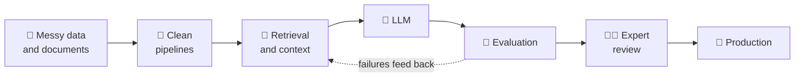

<!-- Header -->


<div align="center">


<br/>

<a href="https://www.linkedin.com/in/vamsitallapudi/"></a>
<a href="mailto:vamsii.tallapudi@gmail.com"></a>

</div>

<br/>

## 👋 About me

```python
vamsi = {
    "role": "AI Engineer",
    "builds": ["production GenAI systems", "RAG", "document intelligence", "LLM evaluation"],
    "domain": "regulated industries: pharma and clinical R&D",
    "exploring": ["interpretability", "agentic workflows", "better ways to evaluate LLMs"],
    "rule_of_thumb": "If you can't measure it, don't ship it.",
}
```

<br/>

## 🧭 How I build AI systems


```mermaid
flowchart LR
    A[📄 Messy data<br/>and documents] --> B[🧹 Clean<br/>pipelines]
    B --> C[🔎 Retrieval<br/>and context]
    C --> D[🧠 LLM]
    D --> E[📏 Evaluation]
    E --> F[👩‍⚕️ Expert<br/>review]
    F --> G[🚀 Production]
    E -. failures feed back .-> C
```

> The model is usually the easy part. Most of the work sits on either side of it: getting the data right before the model sees it, and proving the output is right after.

<br/>

## 🛠️ What I work on

<table>
  <tr>
    <td width="50%" valign="top">
      <h3>🤖 GenAI applications</h3>
      Systems that turn long, unstructured documents into structured, usable output that teams rely on every day.
    </td>
    <td width="50%" valign="top">
      <h3>🔎 RAG and retrieval</h3>
      Search and retrieval over large document sets, with answers that cite their sources.
    </td>
  </tr>
  <tr>
    <td width="50%" valign="top">
      <h3>📏 LLM evaluation</h3>
      LLM-as-judge setups, expert review loops and error analysis, so you know it works instead of hoping it does.
    </td>
    <td width="50%" valign="top">
      <h3>🧱 Data pipelines</h3>
      Getting messy, multi-source data clean and ready for models. Most of the real work lives here.
    </td>
  </tr>
  <tr>
    <td colspan="2" valign="top">
      <h3>🔬 Interpretability</h3>
      Looking inside models with sparse autoencoders to understand what they actually represent.
    </td>
  </tr>
</table>

<br/>

## 💡 Things I've learned the hard way

| | |
|:--:|:--|
| 🐛 | Most LLM bugs are data bugs. |
| 🎯 | An eval set you trust is worth more than a model you like. |
| ⚖️ | No single model wins everywhere. Test on your own task before you pick one. |
| 🔍 | In regulated work, explainable beats impressive. |

<br/>

## 🧰 Toolbox

<div align="center">

**Models and LLM tooling**


<br/><br/>

**Engineering, data and cloud**


</div>

<br/>

<div align="center">

### 🤝 Let's talk

Interested in GenAI that holds up in the real world? I'm always happy to compare notes.

<a href="https://www.linkedin.com/in/vamsitallapudi/"></a>
<a href="mailto:vamsii.tallapudi@gmail.com"></a>

</div>

<!-- Footer -->

